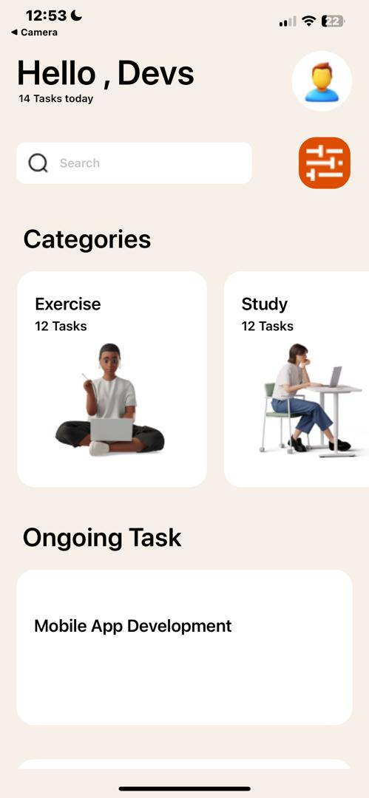

# rn-assignment3-11014893

## Brief description of component's usage;
1.  StatusBar: The StatusBar component from “expo-status-bar” was included to ensure the status bar at the top of the screen is displayed correctly. It’s crucial for maintaining a consistent user experience across different devices.

2.  View: The View component is a fundamental building block in React Native. It was included to structure the layouts and organize different sections of the app effectively. 

3.  Text: The Text component is essential for displaying textual content throughout the application. The Text component ensures that users can read and understand the content easily such as labels, headings and any other textual information.

4.  FlatList: The FlatList component is a powerful tool for rendering lists of data efficiently. It helps display both horizontal and vertical lists. In my case,  it was used for categories (horizontally) and ongoing tasks (vertically). Each category includes an associated image and task count, which provides a clear overview for users.

5.  ScrollView: When the content exceeds the screen size, the ScrollView component comes in handy. It enables scrolling functionality, allowing users to navigate through all the content seamlessly. This is especially useful when the app has a lot of tasks or categories to display.

6.  Image: The Image component allows the showcase of icons, profile pictures, and other graphical content. By incorporating images, I enhanced the visual appeal of the app and made it more engaging for users.

7.  TextInput: The TextInput component is essential for search functionality. Users can input text into the search bar at the top, allowing them to search for specific tasks or categories. It’s a critical feature for enhancing usability.

8.  SafeAreaView: Ensuring that content doesn’t overlap with the device’s status bar is crucial. The SafeAreaView component prevents UI elements from being obstructed by system components like battery and time indicators. It contributes to a polished user experience.

## Screenshot of the app:

